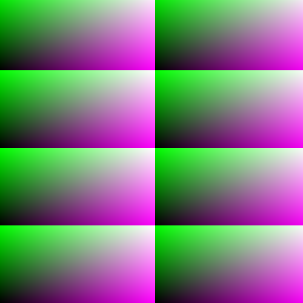

rubyart
=======

Generate interesting PNG and animated GIFs using Ruby.

See [http://www.rubydoc.info/gems/png/1.1.0/PNG/Canvas](http://www.rubydoc.info/gems/png/1.1.0/PNG/Canvas) for information on PNG.

You will need to install the following dependencies. On Ubuntu you can install `imagemagick` and `libmagickwand-dev` in order to install `rmagick`

    gem install png
    gem install RubyInline
    gem install rmagick

`render.rb` is a sample script that demonstrates usaged of `rubyart.rb`.

Example usage and image produced
--------------------------------
To render an image it is important to understand how the engine works. We loop over the coordinates
of an image. The `x` and `y` points, and for each point we generate an `rgb` color. A color for red, green,
and blue. First we generate `r`. To do this we have some numbers available. The `x` and `y` coordinates, a
`gif_factor` which is some number we choose. Mostly used when generating gifs so we can ignore it here.

Once we create `r`, we move to `g` and we additional have the `r` value to work with. Finally we generate
`b` and in this case we now have the `g` value to work with.

At each stage here are the values we have available. `r: x, y, gif_factor`, `g: x, y, r, gif_factor`,
`b: x, y, r, g, gif_factor`.

First we need to required the `rubyart` library.

    require_relative 'rubyart'

Next create a new `RubyArt` object.

    art = RubyArt.new

Now we set three lambda expressions on the `art` object. `r_fn` sets the red color, `g_fn` sets the green
color, and `b_fn` sets the blue color. Above we mentioned the available values so we can return some
value based on some mathematical operations.

    art.r_fn = lambda { |x, y, gif_factor| return x + y + gif_factor }
    art.g_fn = lambda { |x, y, r, gif_factor| return r + x + y + gif_factor }
    art.b_fn = lambda { |x, y, r, g, gif_factor| return g + r + x + y + gif_factor }

Finally render the image.

    art.render_img(0, 'image.png')

Example GIFs
------------
Due to the size of each GIF (~4-6mb) I created a gallery on imgur.

<a target="_blank" href="http://imgur.com/a/h8Yot">http://imgur.com/a/h8Yot</a>
